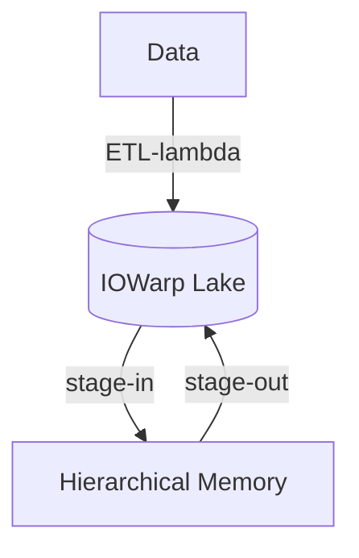

# Content Assimilation Engine

* [s.cpp](s.cpp): Transfer a sample CSV file from Globus to local file system.
* [ydata.ipynb](ydata.ipynb): Measure profiling [performance](https://github.com/iowarp/content-assimilation-engine/wiki/Performance).
