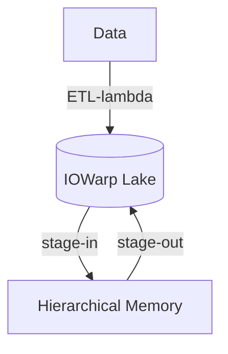

# Content Assimilation Engine

 

* [g.py](g.py): Transfer files from Globus to local file system.
* [s.cpp](s.cpp): Transfer a sample CSV file from Globus to local file system.
* [ydata.ipynb](ydata.ipynb): Measure profiling [performance](https://github.com/iowarp/content-assimilation-engine/wiki/Performance).
* [requirements.txt](requirements.txt): Install required modules for Python.

# Installation

## Python

Use `pip install -r requirements.txt`.

## vcpkg

First, run `vcpkg integrate install` on `iowarp-install/vcpkg`.
Then, run `cmake -DCMAKE_TOOLCHAIN_FILE=iowarp-install/vcpkg/scripts/buildsystems/vcpkg.cmake ..`.
