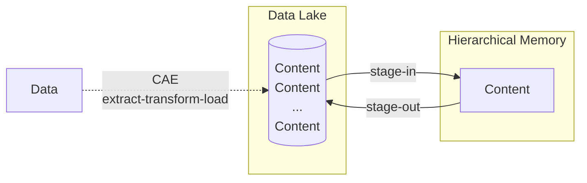

# Content Assimilation Engine
[](https://github.com/iowarp/content-assimilation-engine/actions/workflows/win-omni-r.yml)
[](https://github.com/iowarp/content-assimilation-engine/actions/workflows/mac-omni-r.yml)
[](https://github.com/iowarp/content-assimilation-engine/actions/workflows/ubu-omni-r.yml)

[](https://github.com/iowarp/content-assimilation-engine/actions/workflows/docker.yml) [](https://github.com/iowarp/content-assimilation-engine/actions/workflows/synology.yml)




# Installation

## Conda

Use `$ conda install iowarp::omni`.

## Python

Use `$ pip install -r requirements.txt`.

## vcpkg

1. Install [dependencies](https://github.com/iowarp/iowarp-install?tab=readme-ov-file#vcpkg).
2. Run 
```$ cmake -DCMAKE_TOOLCHAIN_FILE=iowarp-install/vcpkg/scripts/buildsystems/vcpkg.cmake ..```

# Usage

`$ wrp put <omni.yml>`

# Source Codes

* [b.cc](b.cc): Backend Sample
* [g.py](g.py): Transfer files from Globus to local file system.
* [posix_api.cc](posix_api.cc): Frontend Sample
* [s.cpp](s.cpp): Transfer a sample CSV file from Globus to local file system.
* [ydata.ipynb](ydata.ipynb): Measure profiling [performance](https://github.com/iowarp/content-assimilation-engine/wiki/Performance).
* [requirements.txt](requirements.txt): Install required modules for Python.
